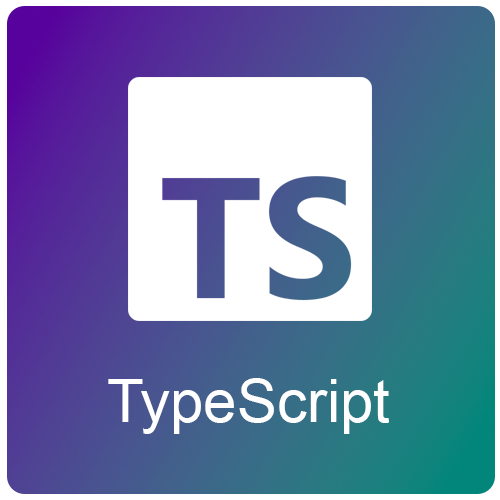
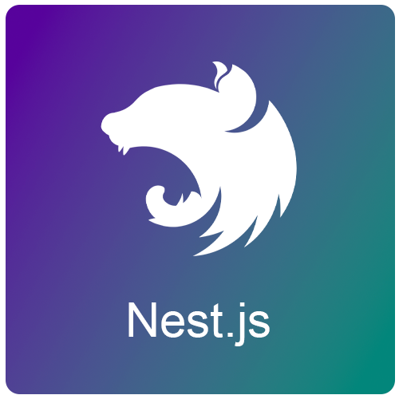
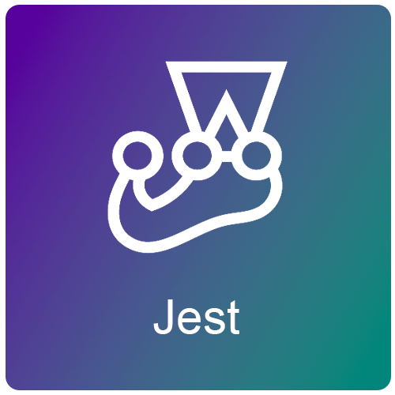
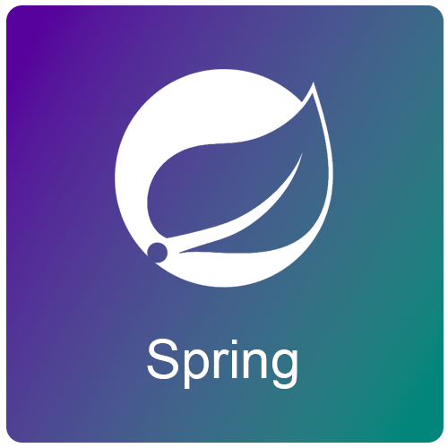
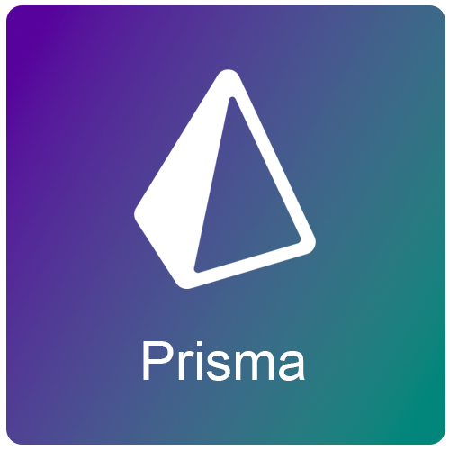
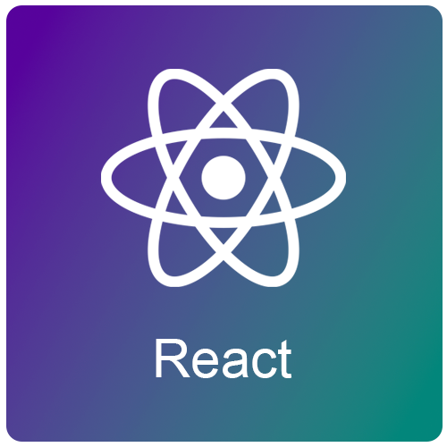

### Hi there! Welcome to my page 👋.

I'm Paulo Paiva, a Full-Stack developer from Itajubá, Brazil 🇧🇷.
 
Since young, I already was passionate about technology and how it can be used to solve real problems.
 
So that, in 2022 I found out the fantastic world of the web development, and it got me absolutely focused to become an expert in this area.

### Favorite Stack

|  |  |      |      | |
| ---------------------------------------------------------------------- | ---------------------------------------------------------------------- | ------------------------------------------------------------------ | -------------------------------------------------------------- | -------------------------------------------------------------- | 
|              |              |          |  | |
|          |  |    |  | |
|            |              |  |    |  |

### GitHub Stats

### Where to Find Me

